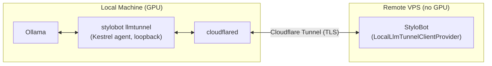
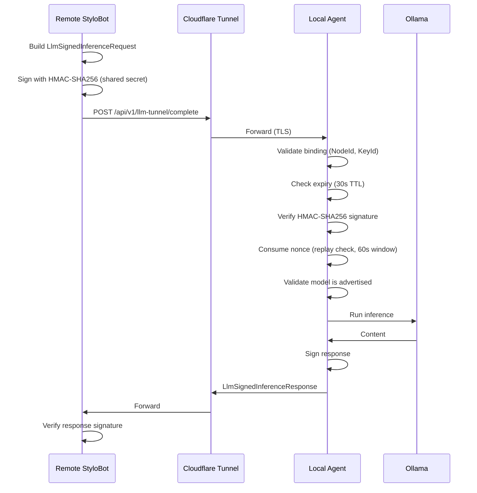

# Local LLM GPU Tunnel

Route LLM classification work from a cloud or VPS instance (no GPU) to a local machine with a GPU and Ollama, using a Cloudflare tunnel as the secure transport.

This is the 4th LLM provider option alongside Heuristic, LlamaSharp, and Ollama. See [ai-detection.md](ai-detection.md) for the provider comparison table.

**NuGet package:** `Mostlylucid.BotDetection.Llm.Tunnel`

---

## Overview



**Flow:**

1. Run `stylobot llmtunnel` on your local GPU machine — it probes Ollama, binds a loopback Kestrel agent (port 0), starts a Cloudflare tunnel, and prints a `sb_llmtunnel_v1_<key>` connection string.
2. Paste that key into the remote StyloBot config as `BotDetection:AiDetection:LocalTunnel:ConnectionKey`.
3. The remote site decodes the key, registers the local GPU node, and routes all LLM classification requests through the tunnel to your Ollama.

All traffic travels through Cloudflare's encrypted tunnel. The agent only listens on `127.0.0.1` — it is never exposed directly to the internet.

---

## Prerequisites

- **`cloudflared`** must be installed and on your PATH on the local GPU machine.
  - macOS: `brew install cloudflared`
  - Linux: see [Cloudflare downloads](https://developers.cloudflare.com/cloudflare-one/connections/connect-networks/downloads/)
  - Windows: download from the same page

- **Ollama** must be running on the local machine with at least one model pulled:
  ```bash
  ollama serve
  ollama pull gemma3:1b
  ```

- For **named tunnels** (stable key across restarts): a Cloudflare account with a named tunnel configured and its token available.

---

## Quick Start

### Terminal 1 — Local GPU machine

```bash
stylobot llmtunnel
```

Output:
```
Probing local Ollama instance...
Found 3 model(s):
  - gemma3:1b
  - llama3.2:1b
  - qwen3.5:4b

Agent listening on http://127.0.0.1:58231
Starting Cloudflare tunnel...

Tunnel: active (cloudflare-quick)
Node:   my-machine (llmn_a1b2c3d4e5f6g7h8)
Models: gemma3:1b, llama3.2:1b, qwen3.5:4b

╔══════════════════════════════════════════════════════════════════╗
║  ANONYMOUS TUNNEL — KEY IS EPHEMERAL                            ║
║  This key changes every time the process restarts with a new     ║
║  tunnel URL. You must re-import the key after each restart.      ║
║  Use a named Cloudflare tunnel token for a stable key.           ║
╚══════════════════════════════════════════════════════════════════╝

Connection key (paste into Stylobot UI or FOSS config):

sb_llmtunnel_v1_eyJWZXJzaW9u...

FOSS config key: BotDetection:AiDetection:LocalTunnel:ConnectionKey

Press Ctrl+C to stop.
```

### Terminal 2 — Remote site (or local test)

```bash
stylobot 5080 https://mysite.example.com --llm localtunnel --llm-key "sb_llmtunnel_v1_..."
```

Or via `appsettings.json`:
```json
{
  "BotDetection": {
    "AiDetection": {
      "LocalTunnel": {
        "ConnectionKey": "sb_llmtunnel_v1_..."
      }
    }
  }
}
```

On startup you will see:
```
[INF] Imported local LLM tunnel node llmn_a1b2c3... (my-machine) from configuration.
```

---

## Anonymous vs Named Tunnels

### Anonymous Tunnels (Quick — no account needed)

`stylobot llmtunnel` with no arguments creates an anonymous Cloudflare quick tunnel. No account required.

**Limitations:**
- The tunnel URL changes every time the process restarts
- The connection key embeds the URL, so it becomes invalid after each restart
- You must re-run `stylobot llmtunnel` and re-import the new key after every restart

**Best for:** Development, testing, or occasional use.

### Named Tunnels (Stable Key)

Named tunnels have a fixed hostname and survive process restarts.

**Setup:**
1. Create a tunnel in the [Cloudflare Zero Trust dashboard](https://one.dash.cloudflare.com/) and copy the tunnel token.
2. Pass the token as the first argument:

```bash
stylobot llmtunnel <your-cloudflare-tunnel-token>
```

The connection key is now stable as long as the tunnel token is valid. Import it once — it keeps working across restarts.

**Best for:** Production or persistent home-lab setups.

---

## Command Reference

```
stylobot llmtunnel [<cloudflare-named-tunnel-token>]
                   [--ollama <url>]
                   [--models <csv>]
                   [--max-concurrency <n>]
                   [--max-context <tokens>]
                   [--agent-port <port>]
```

| Flag | Default | Description |
|------|---------|-------------|
| (first positional) | — | Cloudflare named tunnel token. Omit for anonymous quick tunnel. |
| `--ollama` | `http://127.0.0.1:11434` | Ollama base URL |
| `--models` | all available | Comma-separated allowlist of model names to expose |
| `--max-concurrency` | `2` | Maximum simultaneous inference requests |
| `--max-context` | `8192` | Maximum context tokens (caps Ollama context length) |
| `--agent-port` | `0` (random) | Override the loopback port for the Kestrel agent |

**Examples:**

```bash
# Anonymous tunnel, all models
stylobot llmtunnel

# Anonymous tunnel, specific models only
stylobot llmtunnel --models gemma3:1b,qwen3.5:4b

# Named tunnel
stylobot llmtunnel eyJhIjoiMWFiMmM...

# Named tunnel, cap concurrency
stylobot llmtunnel eyJhIjoiMWFiMmM... --max-concurrency 4 --models llama3.2:1b
```

---

## Configuration Reference

### Remote site — `appsettings.json`

```json
{
  "BotDetection": {
    "AiDetection": {
      "LocalTunnel": {
        "ConnectionKey": "sb_llmtunnel_v1_...",
        "DefaultModel": "gemma3:1b",
        "RequestTimeoutMs": 15000
      }
    }
  }
}
```

| Key | Type | Default | Description |
|-----|------|---------|-------------|
| `ConnectionKey` | string | — | The `sb_llmtunnel_v1_...` key printed by `stylobot llmtunnel` |
| `DefaultModel` | string | first advertised model | Override the model used for inference |
| `RequestTimeoutMs` | int | `15000` | Per-request timeout in milliseconds |

### Remote site — code registration

```csharp
// Reads ConnectionKey from BotDetection:AiDetection:LocalTunnel:ConnectionKey
builder.Services.AddLocalLlmTunnelClient();

// Or inline
builder.Services.AddLocalLlmTunnelClient(opts =>
{
    opts.ConnectionKey = "sb_llmtunnel_v1_...";
    opts.DefaultModel = "gemma3:1b";
    opts.RequestTimeoutMs = 15000;
});
```

---

## Security Model



**Guarantees:**

- **HMAC-SHA256 signing:** Every request is signed with the `ControllerSharedSecret` from the connection key. Requests with invalid signatures are rejected with HTTP 401.
- **30-second request TTL:** Requests include `IssuedAt` / `ExpiresAt`. Expired requests are rejected.
- **60-second nonce replay window:** Each request carries a unique random nonce. The agent rejects any nonce seen in the last 60 seconds.
- **Response signing:** The agent signs its response. The client verifies before trusting the content.
- **Loopback-only agent:** The Kestrel agent binds to `127.0.0.1` only. All external access goes through the Cloudflare tunnel.
- **Secret never exposed:** `ControllerSharedSecret` carries `[JsonIgnore]` — it is never returned by any API endpoint.

### Future: AES-256-GCM payload encryption

The protocol includes an optional `LlmTunnelEnvelope` layer for ECDH/HKDF/AES-256-GCM payload encryption. Not yet activated (Cloudflare's TLS is sufficient for most deployments), but the crypto primitives (`LocalLlmTunnelCrypto.Seal`/`Open`, `DeriveSessionKey`) are implemented and tested.

---

## Connection Key Format

```
sb_llmtunnel_v1_<base64url(UTF8(JSON))>
```

Decoded payload fields:

| Field | Description |
|-------|-------------|
| `NodeId` | Unique node identifier (`llmn_<hex>`) |
| `NodeName` | Machine hostname |
| `TunnelKind` | `cloudflare-quick` or `cloudflare-named` |
| `TunnelUrl` | The Cloudflare tunnel HTTPS URL |
| `AgentPublicKey` | Reserved for future ECDH key exchange |
| `ControllerSharedSecret` | HMAC signing secret (base64url, 32 random bytes) |
| `KeyId` | Key identifier (`k_<hex>`) |
| `Provider` | `ollama` |
| `Models` | Advertised model names |
| `MaxConcurrency` | Concurrency cap |
| `MaxContext` | Context token cap |
| `CreatedAt` | Creation timestamp (UTC) |
| `ExpiresAt` | Expiry (`null` = never) |

---

## Dashboard Status Strip

The dashboard status strip shows a **GPU Tunnels** widget:

- **None configured:** `None configured` in muted text
- **One or more nodes:** Badge showing `active/total` (green dot when any node active)
- **Per-node badges:** Name, first model name + overflow count (e.g. `+2`), status dot, tooltip with full model list / tunnel kind / queue depth

Example: a node named `scotts-air` with 3 models shows as `scotts-air (gemma3:1b+2)`.

---

## Agent API Endpoints

The `stylobot llmtunnel` process exposes three endpoints on the loopback agent (not reachable from outside without the tunnel):

| Endpoint | Method | Description |
|----------|--------|-------------|
| `/api/v1/llm-tunnel/health` | GET | Node health: status, queue depth, concurrency cap, uptime |
| `/api/v1/llm-tunnel/models` | GET | Model inventory: provider, model list with metadata |
| `/api/v1/llm-tunnel/complete` | POST | Signed inference: `LlmSignedInferenceRequest` → `LlmSignedInferenceResponse` |

---

## NativeAOT Compatibility

The `stylobot` console binary publishes as a NativeAOT single-file executable. All JSON serialization in `Mostlylucid.BotDetection.Llm.Tunnel` uses source-generated contexts (`TunnelJsonContext`) — no reflection-based `System.Text.Json` anywhere. The Ollama probe uses `JsonDocument` manual parsing rather than `GetFromJsonAsync<T>`.

---

## Troubleshooting

### `cloudflared: command not found`

Install cloudflared and ensure it is on your PATH.

```bash
# macOS
brew install cloudflared

# Linux (amd64)
curl -L https://github.com/cloudflare/cloudflared/releases/latest/download/cloudflared-linux-amd64 \
  -o /usr/local/bin/cloudflared && chmod +x /usr/local/bin/cloudflared
```

### `Ollama unavailable`

Start Ollama and ensure at least one model is pulled:

```bash
ollama serve
ollama pull gemma3:1b
```

Check the URL with `--ollama http://127.0.0.1:11434` if Ollama is on a non-default port.

### Key becomes invalid after restart

You used an anonymous (quick) tunnel. The URL changes on every restart, invalidating the embedded URL in the key.

**Options:**
- Re-run `stylobot llmtunnel` and re-import the new key after each restart.
- Use a named tunnel for a stable key: `stylobot llmtunnel <cloudflare-token>`.

### `Model 'X' is not advertised by this agent` (HTTP 422)

The `DefaultModel` in the remote config refers to a model not available on the local Ollama, or the `--models` allowlist on the agent excludes it.

Check available models:
```bash
ollama list
```

Either pull the model (`ollama pull X`) or update `DefaultModel` to an available model.

### Inference times out

The default `RequestTimeoutMs` is 15,000ms. Large models on slower hardware may need more:

```json
{
  "BotDetection": {
    "AiDetection": {
      "LocalTunnel": {
        "RequestTimeoutMs": 30000
      }
    }
  }
}
```

### Response signature verification failed

The signing secret in the key does not match what the agent is using. This happens when:
- An old quick-tunnel key is used after restarting (the secret rotates with each start).
- The key was manually edited.

Re-run `stylobot llmtunnel` and import the fresh key.
