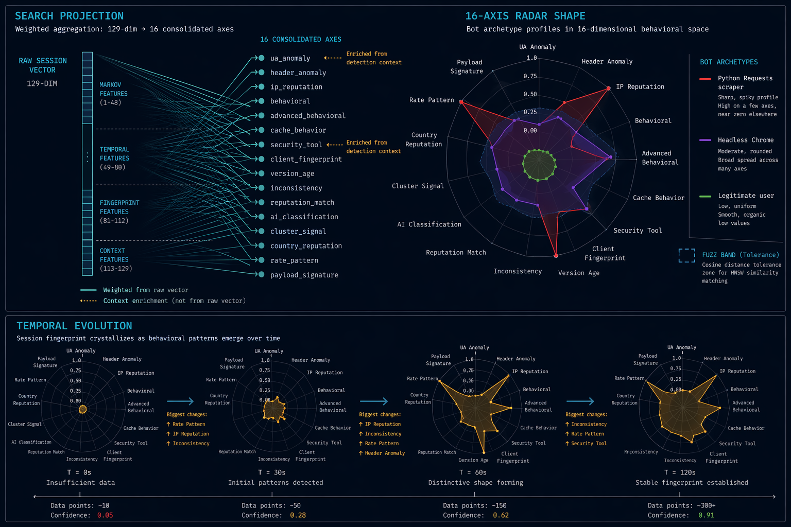

# StyloBot

**Open source bot defense and anonymous entity resolution.** 47 detectors, sub-millisecond inference, progressive identity that learns who keeps coming back - even when they rotate everything. One binary. No cloud dependency.

[](https://www.nuget.org/packages/mostlylucid.botdetection)
[](https://unlicense.org/)

> **This repo is the FOSS product.** It contains the full detection engine, dashboard, entity resolution, and simulation packs. The [commercial product](https://stylobot.net) uses the same engine with additional enterprise features - see [FOSS vs Commercial](#foss-vs-commercial) below.

## Install

```bash
# CLI (macOS + Linux)
brew install scottgal/stylobot/stylobot

# Docker
docker run --rm -p 8080:8080 -e DEFAULT_UPSTREAM=http://host.docker.internal:3000 scottgal/stylobot-gateway:latest

# NuGet (ASP.NET Core)
dotnet add package mostlylucid.botdetection
dotnet add package mostlylucid.botdetection.ui  # dashboard
```

Then:

```bash
# Reverse proxy with live detection table
stylobot 5080 http://localhost:3000

# Production with blocking
stylobot 5080 http://localhost:3000 --mode production --policy block

# Background daemon
stylobot start 5080 http://localhost:3000 --policy block
stylobot status && stylobot logs
```

Or embed as middleware:

```csharp
// Two lines - detection + dashboard, correct middleware ordering guaranteed
builder.Services.AddStyloBot(dashboard => {
    dashboard.AllowUnauthenticatedAccess = true; // dev only
});

app.UseRouting();
app.UseStyloBot();
app.MapControllers();
```

## How it works

StyloBot uses a **blackboard architecture** where 47 detectors run in parallel waves, writing signals that downstream detectors consume. The system progressively builds identity from multiple layers:

```
Request → Wave 0 (< 1ms)      → Wave 1 (behavioral)    → Wave 2 (AI)        → Verdict
          Identity, UA, IP,      Session vectors,          Heuristic model,     Bot probability
          Headers, TLS/TCP,      Periodicity, Cookies,     Intent scoring,      Risk band
          HTTP/2, HTTP/3,        Resource waterfall,       Cluster detection,   Action policy
          Transport, Haxxor,     CVE probes, Waveform      LLM escalation       Entity resolution
          ContentSequence
```

### Vector search projection

The 129-dimensional session vector is projected into interpretable axes for similarity search and visualization:



*Left: 129 raw dimensions aggregated into 16 consolidated axes. Right: bot archetype profiles in radar space - scrapers show sharp spiky profiles, headless browsers show broad spread, humans show low uniform values. Bottom: temporal evolution as the fingerprint crystallizes over time.*

## Detection surface - 47 detectors

| Layer | Detectors | What it catches |
|-------|-----------|-----------------|
| **Identity** | Signature, HeaderCorrelation, Periodicity | UA rotation, identity factors, temporal patterns |
| **Protocol** | TLS (JA3/JA4), TCP/IP (p0f), HTTP/2, HTTP/3, Transport, StreamAbuse | Spoofed browser fingerprints, protocol inconsistencies |
| **Behavioral** | Waveform, SessionVector, AdvancedBehavioral, CacheBehavior, CookieBehavior, ResourceWaterfall, ContentSequence | Timing patterns, Markov chains, missing assets, cookie ignoring, page-load sequence divergence |
| **Content** | UserAgent, Header, AiScraper, Haxxor, SecurityTool, VersionAge | Known bots, attack payloads, impossible browser versions |
| **Network** | IP, GeoChange, ResponseBehavior, MultiLayerCorrelation, CveProbe | Datacenter IPs, impossible travel, CVE scanning, cross-layer mismatches |
| **Intelligence** | FastPathReputation, ReputationBias, TimescaleReputation, Cluster, Similarity, Intent | Historical reputation, Leiden clustering, HNSW similarity, threat scoring |
| **AI** | Heuristic, HeuristicLate, LLM | 50-feature ML model (<1ms), optional LLM for ambiguous cases |
| **Client** | ClientSide, FingerprintApproval, ChallengeVerification, PiiQueryString | JS timing probes, headless detection (Puppeteer/Playwright/Selenium named), PoW challenges |

### Key capabilities

- **Sub-millisecond fast path** - 47 detectors, ~150µs per request, ~175KB allocation
- **Content sequence detection** - tracks the natural document→asset→API page-load order; flags bots skipping directly to APIs or firing at machine speed (<20ms). Centroid freshness auto-suppresses false positives after deploys
- **Anonymous entity resolution** - progressive identity (L0→L5) with merge/split/rewind. Rotation creates a trail of near-miss fingerprints that get linked back to the same actor
- **129-dim session vectors** - Markov chain transitions + timing + fingerprints. Partial chain archetypes detect bots at 3-5 requests before full session maturity
- **Local GPU tunnel** - route LLM inference from a cloud instance to a local GPU via `stylobot llmtunnel` + Cloudflare tunnel; HMAC-signed, zero-config
- **Simulation packs** - honeypots that look like real products. WordPress 5.9 pack included with 8 CVE modules
- **Zero PII** - HMAC-SHA256 hashed signatures. Raw UAs stored PII-stripped (emails/phones redacted). No raw IPs persisted
- **Headless framework naming** - identifies Puppeteer, Playwright, Selenium, PhantomJS by name, not "Unknown Bot"

## FOSS vs Commercial

Two products, same engine. The FOSS product in this repo is complete - it detects bots, resolves identities, runs the dashboard. The [commercial product](https://stylobot.net) adds enterprise operational features on top.

### What's in FOSS (this repo)

- All 47 detectors - same detection pipeline as commercial
- Anonymous entity resolution (merge/split/rewind, L0-L5 confidence)
- Real-time dashboard with all tabs (Overview, Visitors, Sessions, Threats, Clusters, User Agents, Configuration)
- Session vectors, Markov chains, behavioral radar charts
- Simulation packs (WordPress 5.9 with 8 CVE modules)
- SQLite persistence (zero external dependencies)
- Full-text UA search
- BDF replay testing
- CLI binary (6 platforms)
- Docker gateway (YARP reverse proxy)
- Optional LLM enrichment (any provider)
- Local GPU tunnel (`stylobot llmtunnel`) - route cloud LLM inference to a local GPU
- Configuration via YAML manifests (read-only in dashboard)
- Public REST API
- Node.js SDK

### What commercial adds

The [commercial product](https://stylobot.net) is a separate repo that plugs into the FOSS engine via DI. Gateways run unmodified FOSS detection; commercial features are injected at startup.

**Persistence & scale:**
- PostgreSQL + pgvector (replaces SQLite)
- Redis cross-gateway reputation cache, pub/sub config reload, cluster coordination
- Control plane API for fleet management, config, and telemetry aggregation

**Fleet management:**
- Multi-gateway coordination via Redis backplane
- Fleet dashboard with aggregate stats and gateway health
- Leader election for cluster-wide background tasks
- Kubernetes Helm chart (control plane, PostgreSQL HA, Redis Sentinel, HPA gateways)

**Live configuration:**
- Forms-based detector config editor in dashboard, hot-reload via Redis pub/sub
- Per-endpoint policy overrides with live UI
- Config audit trail with rollback

**LLM providers:**
- Managed OpenAI, Anthropic, Azure OpenAI implementations
- Per-use-case routing, cost caps, fallback chains

**Identity & access:**
- Keycloak integration with Ed25519 JWT license validation
- OIDC/SAML SSO for dashboard and API
- Protected identity policies (per-user detection overrides)

**Reporting:**
- Scheduled detection reports and threat intelligence digests
- Webhook alerting on threat events
- Data retention controls

**Additional content:**
- Simulation packs: Django, Rails, Laravel, Spring Boot, Strapi, Shopify
- Identity inspector: entity graph explorer, rotation trail visualization
- Marketing website (ASP.NET Core MVC + Vite/Tailwind)

**License model:** Capability-based JWT tiers (OSS → Startup → SME → Enterprise). Tiers unlock capabilities, never counts. If a license expires, the system **reverts to FOSS mode** - detection continues, PostgreSQL falls back to SQLite, config editor goes read-only. No downtime.

See [stylobot.net](https://stylobot.net) for pricing.

## LLM providers

Detection works fully without any LLM. LLM enriches bot names and handles ambiguous cases.

```bash
stylobot 5080 http://localhost:3000 --llm ollama          # local, free (default: gemma4)
stylobot 5080 http://localhost:3000 --llm openai --llm-key sk-...
stylobot 5080 http://localhost:3000 --llm anthropic --llm-key sk-ant-...

# Route inference from a cloud instance to a local GPU
stylobot llmtunnel                                         # on the GPU machine — prints a connection key
stylobot 5080 http://localhost:3000 --llm localtunnel --llm-key "sb_llmtunnel_v1_..."
```

| Provider | Default model | Cost |
|----------|---------------|------|
| `ollama` | gemma4 | Free (local) |
| `openai` | gpt-4o-mini | ~$0.15/1M tokens |
| `anthropic` | claude-haiku-4-5 | ~$0.25/1M tokens |
| `gemini` | gemini-2.0-flash | Free tier |
| `groq` | llama-3.3-70b | Free tier |
| `localtunnel` | (your local model) | Free — via `Mostlylucid.BotDetection.Llm.Tunnel` |

## Dashboard

Real-time monitoring at `/stylobot`. All data persists to SQLite.

- **Overview** - top threats, traffic chart, world threat map
- **Visitors** - signature-level cards with probability badges (Bot/Suspicious/Uncertain/Human)
- **Sessions** - Markov chain timeline with behavioral radar and session playback
- **Threats** - CVE probe feed, honeypot engagements, severity badges
- **Clusters** - Leiden community detection visualization
- **User Agents** - family breakdown, version distribution, full-text search
- **Configuration** - Monaco YAML editor (read-only in FOSS)

## Repo layout

```
Mostlylucid.BotDetection/              Core detection library (NuGet)
Mostlylucid.BotDetection.UI/           Dashboard + SignalR hub (NuGet)
Mostlylucid.BotDetection.Api/          Public REST API
Mostlylucid.BotDetection.Llm.Tunnel/   GPU tunnel relay — route inference to a local GPU
Mostlylucid.BotDetection.Console/      Standalone CLI (6 platforms)
Stylobot.Gateway/                       Docker YARP reverse proxy
test-bdf-scenarios/                     BDF replay test scenarios
docs/                                   Architecture + specs
```

## Requirements

- No external dependencies for FOSS (SQLite is embedded)
- .NET 10.0 (for building from source)
- Commercial: PostgreSQL, optional Redis

## Documentation

- [Quick start](Mostlylucid.BotDetection/docs/quickstart.md)
- [Configuration reference](Mostlylucid.BotDetection/docs/configuration.md)
- [Integration levels](Mostlylucid.BotDetection/docs/integration-levels.md)
- [Action policies](Mostlylucid.BotDetection/docs/action-policies.md)
- [Content sequence detection](Mostlylucid.BotDetection/docs/content-sequence-detection.md)
- [Centroid freshness (deploy false-positive suppression)](Mostlylucid.BotDetection/docs/centroid-freshness.md)
- [Local GPU tunnel](Mostlylucid.BotDetection/docs/local-llm-tunnel.md)
- [CHANGELOG](CHANGELOG.md)

## License

[The Unlicense](https://unlicense.org/) - FOSS core is public domain. Commercial features licensed separately.